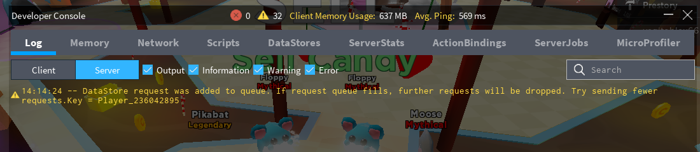

> Whether you're still writing your game code or already ran into a problem while using ProfileService, this page is a valuable resource for avoiding several crucial mistakes.

## Problems in Roblox studio testing

By default, data saved with ProfileService in Roblox Studio will not persist. This can be changed by [enabling studio access to API services](https://developer.roblox.com/en-us/articles/Data-store#using-data-stores-in-studio).

!!! warning
    When studio access to API services is enabled, ProfileService will write to live DataStore keys of the game you're editing
    (unless [ProfileStore.Mock](/ProfileService/api/#profilestoremock) is used) and you might accidentally make unwanted changes to your game's saved data. For more info, check the [official documentation](https://developer.roblox.com/en-us/articles/Data-store#using-data-stores-in-studio).

## Saving data which Roblox cannot serialize

I've made the decision to opt-out `Profile.Data` and `Profile.MetaData.MetaTags` automatic checking
for unserializable data types for efficiency reasons. Consequently, you must be aware of what you
**MUST AVOID** writing inside `Profile.Data` or `Profile.MetaData.MetaTags`, directly and inside any nested tables:

- `NaN` values - you can check if a number is `NaN` by comparing it with itself - `print(NaN == NaN) --> false` (e.g., `Profile.Data = {Experience = 0/0}`). `NaN` values are a result of division by zero and edge cases of some math operations (`math.acos(2)` is `-NaN`).
- Table keys that are neither strings nor numbers (e.g., `Profile.Data[game.Workspace] = true`).
- Mixing string keys with number keys within the same table (e.g., `Profile.Data = {Coins = 100, [5] = "yes"}`).
- Storing tables with non-sequential indexes (e.g., `Profile.Data = {[1] = "Apple", [2] = "Banana", [3546] = "Peanut"}`). If you really have to store non-sequential numbers as indexes, you will have to turn those numbers into `string` indexes: `Profile.Data.Friends[tostring(user_id)] = {GoodFriend = true}`.
- Storing cyclic tables (e.g., `Profile.Data = {Self = Profile.Data}`).
- Storing any `userdata` including `Instance`, `Vector3`, `CFrame`, `Udim2`, etc. Check whether your value is a `userdata` by running `print(type(value) == "userdata")` (e.g., `Profile.Data = {LastPosition = Vector3.new(0, 0, 0)}`) - For storage, you will have to manually convert your `userdata` to tables, numbers and strings for storage (e.g., `Profile.Data = {LastPosition = {position.X, position.Y, position.Z} }`).

This is a limitation of the [DataStore API](https://developer.roblox.com/en-us/articles/Datastore-Errors) which ProfileService is based on.

!!! warning
    Failure to prevent these data types may result in silent data loss, silent errors, fatal errors and overall failure to save data.

## Profiles take over 7 seconds to load

!!! notice
        Due to technical limitations, it's expected that at least 5% of the time, when the player hops servers rapidly, the profile
        can take up to 7 seconds to load (Can be greatly improved by using [Profile:ListenToHopReady()](/ProfileService/api/#profilelistentohopready)).
        If implemented correctly, ProfileService will load profiles as fast as the Roblox API allows
        it when the player joins a server without a server hop. It's recommended to release profiles right before universe teleports
        to speed up session lock releasing and further preventing time penalties related to server hopping as much as possible.
        If your profiles load slower than 7 seconds on a constant basis, continue reading this topic.

**MAKE SURE YOUR [ProfileService](/ProfileService/tutorial/settingup/) MODULE IS UP TO DATE**

Just to be clear, ProfileService **is not** a module that trades in speed for security - if implemented properly, your profiles must usually load within 1 to 2 seconds - that's how long a single [DataStore UpdateAsync](https://developer.roblox.com/en-us/api-reference/function/GlobalDataStore/UpdateAsync) call will take.

**The problem**

More often than not, [ProfileStore:LoadProfileAsync()](/ProfileService/api/#profilestoreloadprofileasync) is taking a clearly longer than usual amount of time to load, usually 7 seconds or much more.

``` lua
local start_time = tick()
ProfileStore:LoadProfileAsync(profile_key)
print(tick() - start_time) --> A value over 10 seconds
```

**The culprit**

 - *Is your code __really__ releasing your profiles after it's done working with them?*
 - *Are you releasing your profiles __immediately__ after the player leaves the game?*
 - *If teleporting between places in your game (universe), are you using [Profile:ListenToHopReady()](/ProfileService/api/#profilelistentohopready)?*

Functions connected to [Players.PlayerRemoving](https://developer.roblox.com/en-us/api-reference/event/Players/PlayerRemoving)
can be tricky to notice errors for because, when testing alone, you will be leaving the game before the errors appear on the
[developer console](https://developer.roblox.com/en-us/articles/Developer-Console).

If a player hops to another server (*Server 2*) before the previous one (*Server 1*) releases (removes session-lock from) the player's `Profile`,
*Server 2* will wait until *Server 1* releases the `Profile`. ProfileService checks the session-lock state of profiles every 7 seconds during a [ProfileStore:LoadProfileAsync()](/ProfileService/api/#profilestoreloadprofileasync) call and this will immediately slow down `Profile` loading very noticably. This is what we would call a **race condition**.

**Mistake example #1:**
``` lua
Players.PlayerRemoving:Connect(function(player)
    local profile = Profiles[player]
    if profile ~= nil then
        progile:Release() -- "progile" IS A TYPO!
    end
end)
```
This example would throw an error, though you would need to be inside the server while another player triggers the `.PlayerRemoving` event.

**Mistake example #2:**
``` lua
Players.PlayerRemoving:Connect(function(player)
    local profile = Profiles[player]
    if profile ~= nil then
        SaveData(profile) -- Are you sure this function doesn't error?
        profile:Release()
    end
end)
```
When you're pretty sure you didn't make any typos, the next thing you should check is that nothing can error inside the function connected to `.PlayerRemoving`.  
> Disclaimer: I don't advise modifying `Profile.Data` after the player leaves - it's a bad practice in securing your data. You should always store data in a way where unexpectedly losing access to writing to `Profile.Data` (e.g. server crash) would not cause massive data loss.

**Mistake example #3:**
``` lua
Players.PlayerRemoving:Connect(function(player)
    local profile = Profiles[player]
    if profile ~= nil then
        wait(1) -- Or any function with "Wait", "Async" or "Yield" in its name
        profile:Release()
    end
end)
```
You should **immediately** release your profiles after the player leaves (`wait(1)` is bad in this example), otherwise you risk creating a race condition where another server that the player joined is trying to load a `Profile` that hasn't been released yet.

**Mistake example #4:**
``` lua
local profile_key, update_handler

-- This simulates excessive UpdateAsync calls for the same Profile key:
for i = 1, 6 do
    ProfileStore:GlobalUpdateProfileAsync(profile_key, update_handler)
end
```
Excessive use of [ProfileStore:GlobalUpdateProfileAsync()](/ProfileService/api/#profilestoreglobalupdateprofileasync) can lead to dead session locks and event lost
`Profile.Data` (latter is mostly possible only if the `Profile` is loaded in the same session as `:GlobalUpdateProfileAsync()` is called). This is due to a queue
system that executes every write request for the `Profile` every 7 seconds - if this queue grows larger than the [BindToClose timeout](https://developer.roblox.com/en-us/api-reference/function/DataModel/BindToClose) (approx. 30 seconds), some requests in the queue can be lost after the game shuts down.

**How to be sure my profiles are being released?**  

Add a `print()`:
``` lua
Players.PlayerRemoving:Connect(function(player)
    local profile = Profiles[player]
    if profile ~= nil then
        profile:Release()
        print(player.Name .. "'s profile has been released!")
    end
end)
```
If you're having long `Profile` loading issues, this is the first thing you should do. Check the developer console for the print and any other possible errors.

When [ProfileStore:LoadProfileAsync()](/ProfileService/api/#profilestoreloadprofileasync) finishes loading in\.\.\.

 - less than 2 seconds - ***You're good!***
 - 7 to 30 seconds - ***Most likely a player server hop race condition (Mistake example #3)***
 - Over 60 seconds - ***The previous server is not releasing the profile / Dead session lock (Mistake examples #1, #2 and #4)***


## DataStore warnings caused by ProfileService



_"DataStore request was added to queue. If request queue fills, further requests will be dropped.
Try sending fewer requests. Key = XXXXXX"_

**Is this really bad?**

If you're only getting one or two warnings every couple of minutes or so, most likely not. Since March 2021 the ProfileService module now uses a custom queue system which greatly reduces Roblox API queue warnings.

**What does this warning mean?**

As of writing this guide (July 2020), based on a [DevForum thread](https://devforum.roblox.com/t/details-on-datastoreservice-for-advanced-developers/175804), Rapid successive UpdateAsync calls will be throttled by the DataStoreService and added to a queue:

> **Throttling queues**
>
> Every actual budget type (GetAsync, SetIncrementAsync, GetSortedAsync, OnUpdateAsync, SetIncrementSortedAsync) has its own throttling queue. Each of these five throttling queues has a queue size of **30 throttled requests max**. Throttled requests are added to the queue of the corresponding budget type that it consumes.

**When will you get warnings**

Queue warnings can no longer be caused by faulty use of ProfileService as of March 2021 (Go update now you bastard). I expect these warnings to sometimes pop up during game startup or huge lag spikes / mild API outages.
